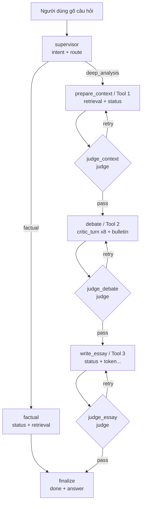

# FE — Cập nhật: Streaming FULL PIPELINE (bản đồng đội vừa hoàn thiện)

> **Đối tượng đọc:** dev/AI làm Frontend đã ráp bản stream cũ. Tài liệu này liệt kê
> **cái gì MỚI cần thêm** khi backend đã bật đủ pipeline: nhánh **factual thật**,
> **Tool 1 (prepare_context)**, **Tool 3 (write_essay) + token essay**, và **3 cổng
> giám khảo (judge)** có vòng lặp retry.
>
> **Phần TRUYỀN TẢI (SSE, fetch + ReadableStream, parse `data:`) KHÔNG đổi** — dùng
> nguyên code ở `frontend_streaming_integration_guide.md` §7. Doc này chỉ nói về
> **FLOW + EVENT** mới. Endpoint vẫn là **`POST /chat/stream`**, hợp đồng `StreamEvent`
> (seq/type/node/actor/content/payload.ui/ts) **giữ nguyên**.

---

## 0. TL;DR — bản cũ FE đã có gì, giờ cần thêm gì

| Bạn ĐÃ handle (bản cũ)              | GIỜ CẦN THÊM                                                             |
| ----------------------------------- | ------------------------------------------------------------------------ |
| `intent` / `route` (supervisor)     | **`status` + `retrieval` cho nhánh factual** (trước đây factual câm)     |
| `critic_turn` / `bulletin` (debate) | **`retrieval` + `status` của Tool 1** (`node="prepare_context"`)         |
| **1** `judge` + `finalize`(`done`)  | **3 cổng judge** (context / debate / essay), phân biệt qua `node`        |
|                                     | **vòng lặp `retry`** — cùng cụm event có thể lặp lại                     |
|                                     | **`token` (essay chảy chữ)** — trước để "tương lai", **giờ đã bật thật** |

→ Về mặt code, FE **không cần đổi transport**; chỉ cần **thêm case xử lý** cho
`status`, `retrieval`, `token`, và **nhận diện 3 judge + retry**.

---

## 1. Sơ đồ FLOW hoàn chỉnh



- **Nhánh factual** (tra cứu ngắn): `intent → route → status → retrieval → done`.
- **Nhánh deep** (phân tích sâu): đi qua **3 cổng judge**, mỗi cổng có thể `retry`
  quay lại tool trước đó (tối đa theo `limit`), rồi mới sang tool kế.

---

## 2. Chuỗi event ĐẦY ĐỦ cho nhánh DEEP (theo thứ tự thời gian)

| #     | `type`        | `node`                  | `actor`        | `content` (ví dụ)                         | `payload` (ngoài `ui`)                                     | `group`   |
| ----- | ------------- | ----------------------- | -------------- | ----------------------------------------- | ---------------------------------------------------------- | --------- |
| 1     | `intent`      | `supervisor:intent`     | Điều phối      | "…phân tích sâu"                          | `work_title, author, route, confidence, detected_entities` | intent    |
| 2     | `route`       | `supervisor:intent`     |                | "deep_analysis"                           | `route`                                                    | intent    |
| 3     | `retrieval`   | `prepare_context`       |                | "Đã truy hồi 8 đoạn trích từ: Vợ Nhặt"    | `count, works[]`                                           | retrieval |
| 4     | `status`      | `prepare_context`       |                | "Đang phân tích & tóm tắt ngữ cảnh…"      | —                                                          | intent    |
| 5     | `status`      | `prepare_context`       |                | "Đã dựng ngữ cảnh: 5 thực thể, chủ đề: …" | `themes[], entities[]`                                     | intent    |
| 6     | `judge`       | `judge:prepare_context` | Giám khảo      | lý do chấm Tool 1                         | `verdict, scores{}, feedback`                              | judge     |
| —     | `retry`\*     | `judge:prepare_context` | Giám khảo      | feedback sửa                              | `stage:"prepare_context", attempt, limit`                  | judge     |
| 7–10  | `critic_turn` | `critic:<role>:r1`      | Nhà phê bình … | "Luận đề: …" (vòng 1)                     | `round:1, parsed_ok, arguments[]`                          | debate    |
| 11    | `bulletin`    | `debate:bulletin`       |                | "Bảng tin chung đã sẵn sàng."             | `entries[]`                                                | debate    |
| 12–15 | `critic_turn` | `critic:<role>:r2`      | Nhà phê bình … | "…" (vòng 2)                              | `round:2, rebuttals[]`                                     | debate    |
| 16    | `judge`       | `judge:critics_debate`  | Giám khảo      | lý do chấm debate                         | `verdict, scores{}, feedback`                              | judge     |
| —     | `retry`\*     | `judge:critics_debate`  | Giám khảo      | feedback sửa                              | `stage:"critics_debate", attempt, limit`                   | judge     |
| 17    | `status`      | `write_essay`           |                | "Đang viết bài luận…"                     | —                                                          | intent    |
| 18…   | `token`\*\*   | `write_essay`           |                | mẩu chữ bài luận                          | `is_partial:true`                                          | final     |
| n     | `status`      | `write_essay`           |                | "Đã hoàn thành bản thảo: … (N từ)"        | `title, word_count`                                        | intent    |
| n+1   | `judge`       | `judge:write_essay`     | Giám khảo      | lý do chấm essay                          | `verdict, scores{}, feedback`                              | judge     |
| —     | `retry`\*     | `judge:write_essay`     | Giám khảo      | feedback sửa                              | `stage:"write_essay", attempt, limit`                      | judge     |
| cuối  | `done`        | `finalize`              |                | "Hoàn tất."                               | **`answer`**, `route, chars, citations`                    | final     |

\* `retry` chỉ xuất hiện khi `judge.payload.verdict == "retry"`; sau đó **cụm event của
tool tương ứng LẶP LẠI** (xem §5).
\*\* `token` là các mẩu chữ của bài luận (xem §4).

---

## 3. Chuỗi event nhánh FACTUAL (đã thật, không còn câm)

```
intent → route → status("Đang tra cứu tài liệu…") → retrieval("Đã tra cứu N đoạn…") → done
```

| #   | `type`      | `node`              | `content`                             | `payload`                    |
| --- | ----------- | ------------------- | ------------------------------------- | ---------------------------- |
| 1   | `intent`    | `supervisor:intent` | "…tra cứu"                            | `route:"factual", …`         |
| 2   | `route`     | `supervisor:intent` | "factual"                             | `route`                      |
| 3   | `status`    | `factual`           | "Đang tra cứu tài liệu…"              | —                            |
| 4   | `retrieval` | `factual`           | "Đã tra cứu 3 đoạn trích từ: Vợ Nhặt" | `count, works[]`             |
| 5   | `done`      | `finalize`          | "Hoàn tất."                           | **`answer`**, `route, chars` |

→ FE dùng chung 1 renderer với deep; chỉ là factual **không có** debate/judge/essay.

---

## 4. ⭐ `token` — bài luận giờ CHẢY CHỮ (trước đây để "tương lai")

Node `write_essay` phát 1 chuỗi event `type:"token"`, `is_partial:true`, `node:"write_essay"`,
`content` = mẩu chữ. **Cách nối vào bong bóng answer** (giống §6.6 guide cũ, giờ dùng thật):

```ts
if (ev.type === 'token' && ev.is_partial) {
  answer += ev.content // gõ dần vào bong bóng AI
}
if (ev.type === 'done') {
  answer = ev.payload.answer // ⭐ CHỐT bằng bản chuẩn (ghi đè bản gõ dần)
}
```

**Lưu ý quan trọng (đọc kỹ để không kỳ vọng sai):**

- Backend hiện tạo bài bằng structured output rồi **tua lại** token **sau khi sinh xong**,
  nên các `token` **đổ ra gần như một cụm** ngay trước `done` — **không phải** gõ realtime
  lúc model đang nghĩ. Muốn "gõ chữ" mượt, **FE tự làm animation** (đệm token vào buffer rồi
  hiển thị theo nhịp), đừng phụ thuộc nhịp đến của mạng.
- `token` **KHÔNG** có trong `state.events` của `/chat/llm-extended` (bản replay) — chỉ có
  ở `/chat/stream`. Replay tĩnh lấy bài luận từ `state.final_ai_response` / `done.answer`.
- **Nguồn sự thật của bài luận là `done.payload.answer`.** `token` chỉ để hiển thị động;
  luôn ghi đè bằng `done.answer` ở cuối.

---

## 5. ⭐ 3 cổng JUDGE + vòng lặp RETRY

Trước đây chỉ 1 judge. Giờ có **3 cổng**, cùng `type:"judge"` và cùng `group:"judge"`,
**phân biệt bằng `node`** (hoặc `retry.payload.stage`):

| Cổng    | `node` của event judge  | Chấm cái gì                         | Retry quay về     |
| ------- | ----------------------- | ----------------------------------- | ----------------- |
| Context | `judge:prepare_context` | Tool 1 đủ chi tiết chưa             | `prepare_context` |
| Debate  | `judge:critics_debate`  | Tranh luận có chiều sâu chưa        | `debate`          |
| Essay   | `judge:write_essay`     | Bài luận đạt logic/style/depth chưa | `write_essay`     |

**Verdict** (đọc ở `judge.payload.verdict` — màu đã có sẵn trong `payload.ui`):

| verdict  | ý nghĩa                                                         | `ui.color` / severity     |
| -------- | --------------------------------------------------------------- | ------------------------- |
| `pass`   | đạt → đi tiếp                                                   | green `#22c55e` / success |
| `retry`  | chưa đạt → **có thêm 1 event `retry`** rồi **lặp lại cụm tool** | amber `#f59e0b` / warning |
| `reject` | **hết lượt** retry → dùng bản tốt nhất, vẫn đi tiếp             | red `#ef4444` / error     |

**Vòng lặp retry — FE cần biết:** khi thấy `retry` (kèm `payload = {stage, attempt, limit}`),
**các event của tool tương ứng sẽ XUẤT HIỆN LẠI** (ví dụ retry ở debate → lại nhận 8
`critic_turn` + `bulletin` + `judge` lần nữa). **FE cứ append theo thứ tự nhận** — không
cần dedup. Muốn hiển thị đẹp thì dùng `attempt/limit` để ghi nhãn "Lượt 2/2".

```ts
if (ev.type === 'judge') {
  const stage = ev.node.replace('judge:', '') // prepare_context | critics_debate | write_essay
  const verdict = ev.payload?.verdict // pass | retry | reject
  // render vào lane "judge", màu = ev.payload.ui.color
}
if (ev.type === 'retry') {
  const { stage, attempt, limit } = ev.payload // báo "đang làm lại {stage}, lượt {attempt}/{limit}"
}
```

---

## 6. Gom lane timeline (gợi ý render)

Vẫn gom theo `payload.ui.group` như cũ, nay có đủ 5 lane:

| lane (`group`) | Event rơi vào                  | Ý nghĩa hiển thị                   |
| -------------- | ------------------------------ | ---------------------------------- |
| `intent`       | `intent`, `route`, `status`    | Hiểu câu hỏi & chuẩn bị/tiến trình |
| `retrieval`    | `retrieval` (factual + Tool 1) | Truy hồi tài liệu                  |
| `debate`       | `critic_turn`×8, `bulletin`    | Tranh luận (4 critic × 2 vòng)     |
| `judge`        | `judge`×(1–3), `retry`         | Giám khảo chấm (3 cổng)            |
| `final`        | `token`, `done`                | Bài luận & kết quả cuối            |

4 critic mỗi người 1 màu riêng theo `payload.ui.variant` (`hinh_thuc`/`lich_su`/`tam_ly`/
`tiep_nhan`) — không đổi so với bản cũ.

---

## 7. Quy tắc thứ tự (nhắc lại — quan trọng)

- **Bản LIVE (`/chat/stream`): append theo ĐÚNG THỨ TỰ NHẬN.** **ĐỪNG sort theo `seq`** —
  event debate phát từ subgraph có `seq` best-effort **trùng số** với event ngoài, và
  `token` làm `seq` nhảy vọt. Cần chắc thì sort theo **`ts`**.
- **Bản REPLAY (`/chat/llm-extended`): `state.events` có `seq` sạch tuần tự** → sort theo
  `seq`. (Bản này KHÔNG có `token`.)

---

## 8. Checklist cập nhật FE

- [ ] Thêm case `status` → hiện dòng tiến trình (lane intent), có thể là spinner + text.
- [ ] Thêm case `retrieval` → hiện "Đã truy hồi N đoạn…" (dùng cho **cả** factual & Tool 1).
- [ ] Bật case `token` → `answer += content`; **`done` ghi đè** `answer = done.payload.answer`.
- [ ] Nhận diện **3 judge** qua `ev.node` (`judge:<stage>`); tô màu theo `payload.ui`.
- [ ] Xử lý `retry`: đọc `payload.stage/attempt/limit`, **cho phép cụm event lặp lại** (append).
- [ ] Nhánh factual: đảm bảo render được `status`/`retrieval` (không còn giả định factual câm).
- [ ] Giữ nguyên transport SSE + parser + KHÔNG sort theo `seq` ở bản live.
- [ ] Phòng thủ: `ev.payload?.ui` (event `error` không có `payload`/`ui`).

---

## 9. Ví dụ 1 phiên stream DEEP (rút gọn, có đủ 3 judge + token)

```
data: {"type":"intent","node":"supervisor:intent","actor":"Điều phối","content":"…phân tích sâu","payload":{"route":"deep_analysis","ui":{"group":"intent","color":"#64748b"}}}
data: {"type":"route","node":"supervisor:intent","content":"deep_analysis","payload":{"route":"deep_analysis","ui":{"group":"intent"}}}
data: {"type":"retrieval","node":"prepare_context","content":"Đã truy hồi 8 đoạn trích từ: Vợ Nhặt","payload":{"count":8,"works":["Vợ Nhặt"],"ui":{"group":"retrieval"}}}
data: {"type":"status","node":"prepare_context","content":"Đang phân tích & tóm tắt ngữ cảnh…","payload":{"ui":{"group":"intent"}}}
data: {"type":"status","node":"prepare_context","content":"Đã dựng ngữ cảnh: 5 thực thể…","payload":{"themes":["số phận"],"ui":{"group":"intent"}}}
data: {"type":"judge","node":"judge:prepare_context","actor":"Giám khảo","content":"Context đủ chi tiết.","payload":{"verdict":"pass","scores":{"detail":0.8},"ui":{"group":"judge","color":"#22c55e","severity":"success"}}}
data: {"type":"critic_turn","node":"critic:tam_ly:r1","actor":"Nhà phê bình Tâm lý","content":"Luận đề: …","payload":{"round":1,"arguments":[{"arg_id":"tam_ly-a1","point":"…","support":"…"}],"ui":{"variant":"tam_ly","color":"#8b5cf6","group":"debate"}}}
... (3 critic R1 khác) ...
data: {"type":"bulletin","node":"debate:bulletin","content":"Bảng tin chung đã sẵn sàng.","payload":{"entries":[...],"ui":{"group":"debate"}}}
... (4 critic R2, payload.round=2, rebuttals=[...]) ...
data: {"type":"judge","node":"judge:critics_debate","actor":"Giám khảo","content":"Debate đủ chiều sâu.","payload":{"verdict":"pass","ui":{"group":"judge","color":"#22c55e"}}}
data: {"type":"status","node":"write_essay","content":"Đang viết bài luận…","payload":{"ui":{"group":"intent"}}}
data: {"type":"token","node":"write_essay","content":"## Mở bài\n","is_partial":true,"payload":{"ui":{"group":"final"}}}
data: {"type":"token","node":"write_essay","content":"Nhân ","is_partial":true,"payload":{"ui":{"group":"final"}}}
... (nhiều token) ...
data: {"type":"status","node":"write_essay","content":"Đã hoàn thành bản thảo: … (612 từ)","payload":{"title":"…","word_count":612,"ui":{"group":"intent"}}}
data: {"type":"judge","node":"judge:write_essay","actor":"Giám khảo","content":"Bài đạt yêu cầu.","payload":{"verdict":"pass","ui":{"group":"judge","color":"#22c55e"}}}
data: {"type":"done","node":"finalize","content":"Hoàn tất.","payload":{"route":"deep_analysis","answer":"<TOÀN BỘ BÀI LUẬN>","chars":3560,"citations":0,"ui":{"group":"final","color":"#22c55e"}}}
```

Ví dụ có **retry** (chèn giữa, ví dụ ở debate):

```
data: {"type":"judge","node":"judge:critics_debate","content":"Thiếu phản biện.","payload":{"verdict":"retry","feedback":"Cần đối thoại sâu hơn","ui":{"group":"judge","color":"#f59e0b","severity":"warning"}}}
data: {"type":"retry","node":"judge:critics_debate","actor":"Giám khảo","content":"Cần đối thoại sâu hơn","payload":{"stage":"critics_debate","attempt":1,"limit":2,"ui":{"group":"judge","severity":"warning"}}}
... (8 critic_turn + bulletin XUẤT HIỆN LẠI) ...
data: {"type":"judge","node":"judge:critics_debate","payload":{"verdict":"pass",...}}
```

```

```
